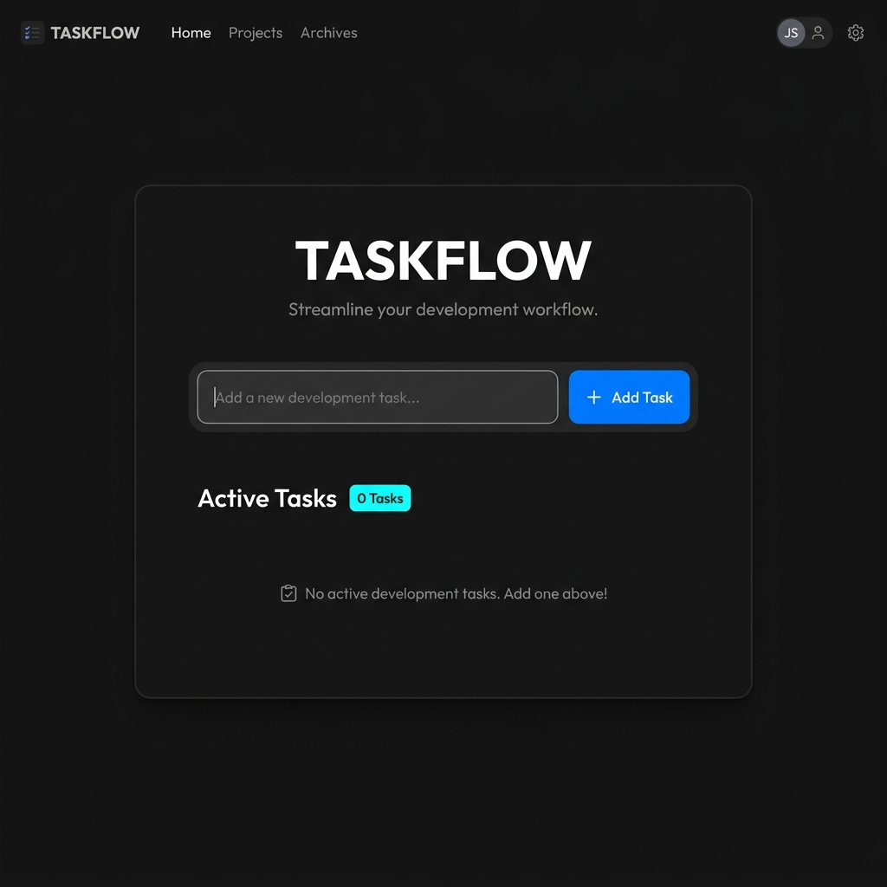
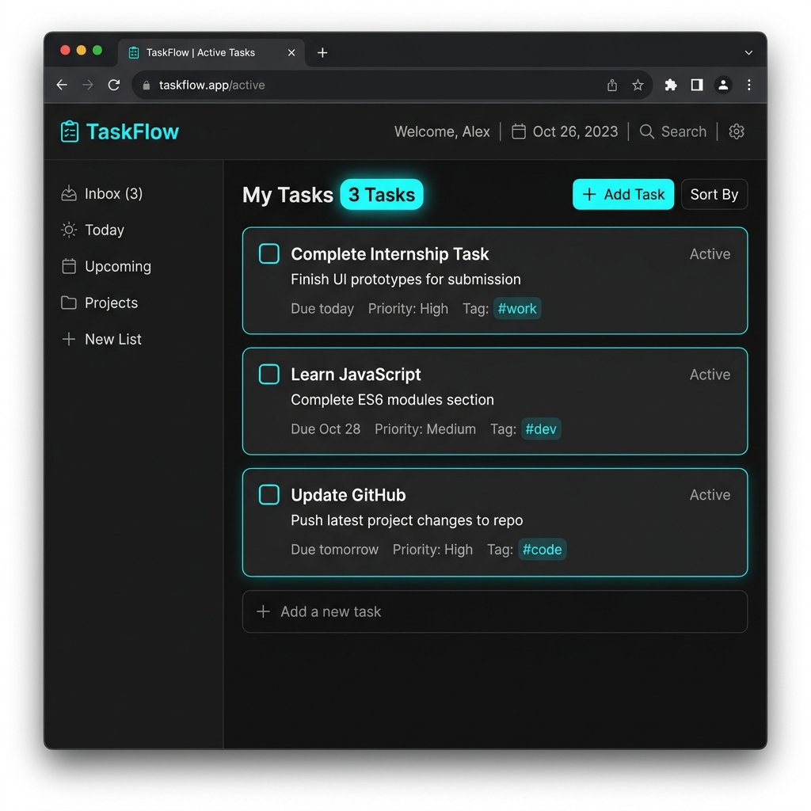
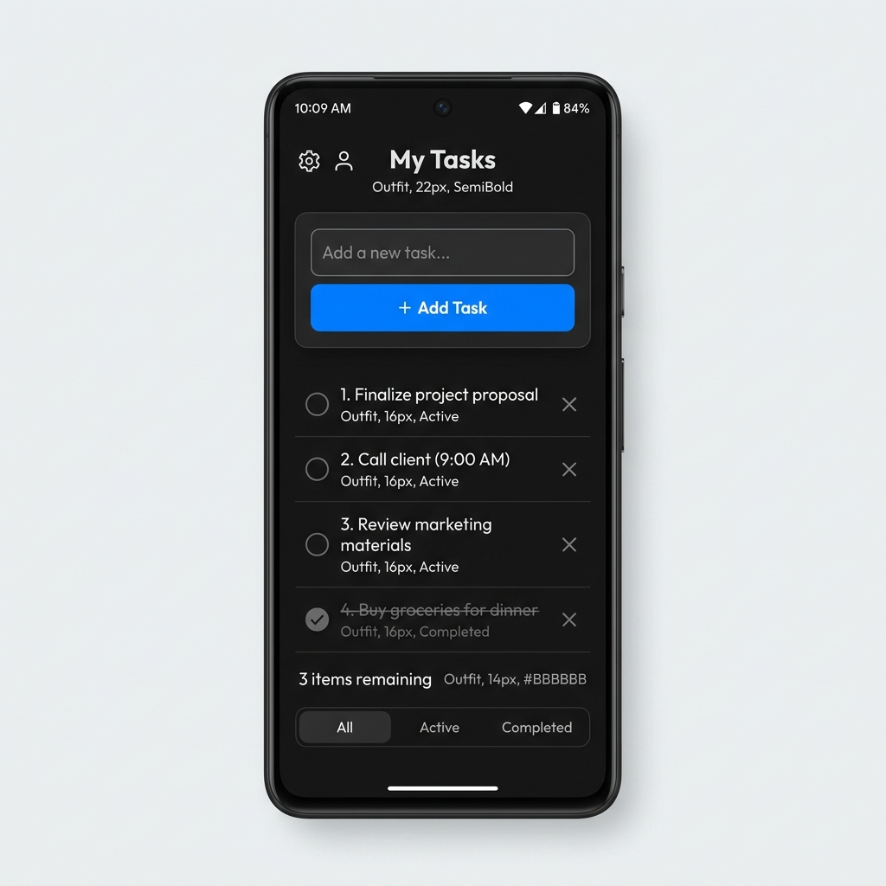

# 📝 TaskFlow | Modern To-Do List Web Application

Welcome to **TaskFlow**! This is a modern, single-page, responsive To-Do List Web Application designed for managing development sprint tasks. This project is built as **Task 5** of the **Synent Technologies Web Development Internship Program**.

---

## 📌 Overview

**TaskFlow** provides a clean, visual-first dashboard interface for tracking active tasks. Built purely with native frontend languages—**HTML5**, **CSS3**, and **JavaScript (ES6)**—it features a custom cyberpunk dark theme, frosted glass wrapper panels, glowing active states, and dynamic DOM insertions with entry transition animations.

---

## 🌟 Features

*   [x] **Add Task**: Instantly append new items to your sprint checklist via mouse clicks or the `Enter` key.
*   [x] **Delete Task**: Immediately remove completed or obsolete tasks from the checklist.
*   [x] **Mark Task as Completed**: Toggle task state dynamically with a visual check badge and strike-through styles.
*   [x] **localStorage Support**: Automatically saves active and completed tasks to local storage to persist state across refreshes.
*   [x] **Responsive Design**: Auto-stacking input fields and responsive buttons optimized for extra-small viewports.
*   [x] **Modern UI**: Dark obsidian color palettes, frosted panels, cyan glow active states, and entrance animations.

---

## 🎓 Learning Outcomes

Through developing this project, I achieved the following learning outcomes:
- **Improved JavaScript Skills**: Strengthened fundamentals in variables, arrays, callback functions, and standard ES6 syntaxes.
- **Learned DOM Manipulation**: Mastered active element creation, styling attachment, and removal of nodes on actions.
- **Learned localStorage**: Mastered persistent local cache storage methods using serialization (`JSON.stringify`/`JSON.parse`).
- **Improved Responsive Design Skills**: Engineered layout adapters that reposition elements cleanly across mobile and desktop boundaries.
- **Improved GitHub Workflow**: Followed standard repository initializing, branch managing, force updates, and sequential committing logs.

---

## 🛠️ Technologies Used

| Technology | Purpose | Core Implementations |
| :--- | :--- | :--- |
| **🌐 HTML5** | Semantic Structure | Main page wrappers, layout boxes, inputs, buttons, and badges. |
| **🎨 CSS3** | Visual Presentation | Custom variables (HSL tokens), Flexbox, media queries, keyframe scaling transitions, and blur backdrops. |
| **⚡ JavaScript (ES6)** | Dynamic Interactivity | DOM select mappings, event bindings, validation checks, localStorage serialization, checkbox checking, card deletion, and counter updates. |

---

## 📂 Project Structure

Below is the workspace layout:

```text
Task5-TodoApp/
├── screenshots/              # Preview captures for task evaluation
│   ├── app_homepage.png
│   ├── active_tasks.png
│   ├── mobile_view.png
│   └── completed_task.png
├── index.html                # Main semantic markup document
├── style.css                 # Advanced CSS stylesheet with animations
├── script.js                 # Task lifecycles and DOM manipulation script
└── README.md                 # Project documentation (This File)
```

---

## 📸 Screenshots

Here are the visual representations of the To-Do Application across different layouts:

### 🖥️ Application Homepage (Obsidian Void Theme)


### ✍️ Dynamic Task Entry & Checking (Cyber-Glow Outline)


### 📱 Responsive Mobile View (Stacked Inputs)


---

## 🔮 Future Improvements

Features planned for upcoming releases:
*   [ ] **Task Prioritization**: Color-coded badges for High, Medium, and Low priorities.
*   [ ] **Subtasks Checklist**: Nest bullet-point lists under a main task card.
*   [ ] **Task Search/Filter**: Search bar to locate specific active or completed cards.

---

## 👤 Author Section

*   **Name**: Dhrupal Godhani
*   **Role**: Web Development Intern at Synent Technologies
*   **Email**: [dhrupalgodhani24@gmail.com](mailto:dhrupalgodhani24@gmail.com)
*   **Track**: Web Development & Cybersecurity
*   **GitHub**: [DHRUPAL5404](https://github.com/DHRUPAL5404)
